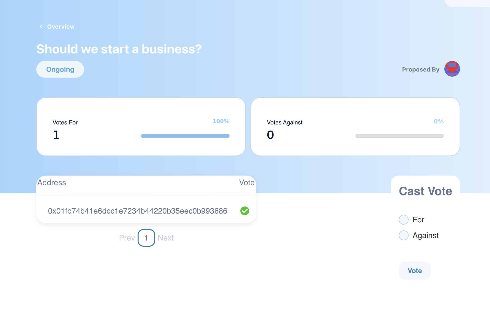

# Dao
A simple Decentralized Autonomous Organization built on the Polygon Mumbai-Testnet blockchain, which lets users create and vote for/against proposals on-chain created by owners of a specific NFT (governance token).

### Home

### Proposal

